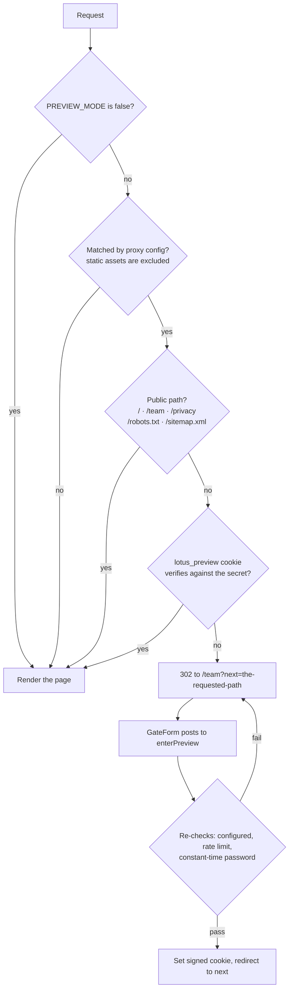
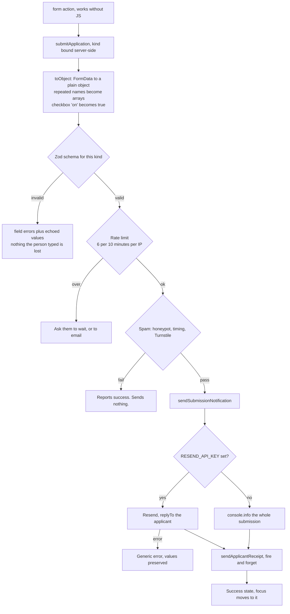

# Architecture

How this site is built, and why it is built that way. The short version: it is a
Next.js 16 App Router site with no database, no user accounts and no client-side
state library. Almost everything is a Server Component rendering typed data from
`src/config/`. The three parts that needed real thought are the preview gate, the
form pipeline, and the lotus.

---

## 1. The preview gate

Before launch the whole site is hidden behind a single shared password, so that
the festival committee, the City, sponsors and translators can review it without
it appearing in search results or being mistaken for the real thing.

**It is a soft gate, and it is documented as one.** The pages behind it are the
future public site. Nothing sensitive is back there, and nothing sensitive ever
should be — see [`SECURITY.md`](../SECURITY.md). It is still built properly,
because a badly built gate teaches bad habits to everyone who reads this
repository.

### `proxy.ts`, not `middleware.ts`

Next.js 16 renamed `middleware.ts` to **`proxy.ts`** and moved it to the **Node.js
runtime** by default. That rename is not cosmetic here: on the Edge runtime this
file could not have used `node:crypto`, and the gate would have needed an
Edge-compatible JWT library as a dependency. On Node it can call
`createHmac` and `timingSafeEqual` directly, which is why
`src/lib/preview/session.ts` has no dependencies at all.

Two consequences worth knowing before you edit `src/proxy.ts`:

- **Do not add `export const runtime`.** Next throws if a proxy file sets it.
- **The `matcher` must be a statically analyzable literal.** Next cannot read a
  variable or a template string there. Without the matcher, the proxy would run
  on `_next/static`, the image optimizer and everything in `public/` — silently
  gating the CSS and the fonts along with the pages.

### The token

The session cookie is `lotus_preview`, and its value is a signed token rather
than `preview=1`:

```
v1.<unix-expiry>.<base64url HMAC-SHA256 of "v1.<unix-expiry>">
```

- The token **carries its own expiry**, so there is no session store to run.
- Anyone can read this source. Without `PREVIEW_SESSION_SECRET` they still
  cannot mint a token.
- **Rotating `PREVIEW_SESSION_SECRET` revokes every issued session at once.**
  That is the emergency lever if the password gets out.

The password comparison is constant-time. Both sides are SHA-256 hashed first so
the buffers always have equal length — `timingSafeEqual` throws on a length
mismatch, and that exception is itself a timing signal leaking the length of the
real password.

In development, an unset `PREVIEW_PASSWORD` falls back to `Lotus2027` and an
unset secret becomes a random per-process value, so a fresh clone runs with no
setup. **In production there is no fallback**: with either unset, the gate
refuses everyone. Failing closed is the right direction for a gate.

### The request path



### Why the action re-checks everything

`src/app/team/actions.ts` re-runs every check the proxy just ran. That is not
belt-and-braces paranoia; it is required.

**Server Actions POST to the page they live on, not to a route of their own.**
Proxy route matching therefore does not reliably cover them. An action that
trusts the proxy to have already checked is an action with no check at all. So
`enterPreview` verifies the gate is configured, rate-limits by IP, and compares
the password itself.

The same rule is written at the top of `src/app/actions.ts`: anything needing
authorization must check it in the action. None of the public form actions do,
because they are all intentionally public — but the next person to add one needs
to know the rule before they need it.

There is a third layer as well. `src/app/(site)/layout.tsx` sets
`robots: { index: false }` on every gated page, and `src/app/robots.ts` serves a
`Disallow` while `PREVIEW_MODE` is on. Belt, braces, and a note to the crawler:
an unfinished page describing an unconfirmed festival must not end up in a search
index, where it will outlive the preview by months.

### The open-redirect guard

`?next=` arrives from the query string, so it is attacker-controlled. Only
same-origin absolute paths are accepted, and `//evil.example` is rejected
explicitly — a protocol-relative URL leaves the site while looking like a path.
The check is duplicated in `team/page.tsx` and in the action, for the reason
above.

---

## 2. The form pipeline

Seven application forms — volunteer, vendor, food booth, performer, sponsor,
dragon boat team, general enquiry — plus the newsletter signup. All of them run
through one implementation.

### Progressive enhancement first

Forms are **Server Actions**, not `fetch` calls to route handlers. A vendor
filling in a booth application on a phone with one bar of signal in Echo Park can
submit before the JavaScript has finished loading, or with it disabled entirely.
That is the difference between an application received and an application
abandoned.

`FormShell` (`src/components/forms/FormShell.tsx`) owns the parts that must be
right on every form and are easy to get subtly wrong: the anti-spam fields, a
result banner that is announced *and* focused, and a submit button that reports
its own pending state so nobody submits three times because nothing appeared to
happen.

### One action, seven forms

```tsx
const action = submitApplication.bind(null, "vendor");
```

The form kind is **bound on the server**, not posted as a hidden field, so a
client cannot swap it. The alternative — seven near-identical copies of the
validate / rate-limit / spam-check / send sequence — is seven places for the spam
check to be forgotten.

### End to end



Four details in that path are deliberate:

- **`echoValues` runs on every failure path.** A validation error must never
  wipe what someone typed into a fifteen-field application.
- **Field names must exactly match the Zod schema.** A mismatch is silent data
  loss — the field submits, the schema ignores it, the committee never sees it.
  `tests/validation.test.ts` exists because of this.
- **The receipt is fire-and-forget.** If the courtesy email fails, the festival
  still has the submission, so the applicant is told it worked — which is true.
- **A failed spam check reports success.** Telling a bot which heuristic caught
  it is free tuning information. The cost is that a false positive looks like
  success to a real person, which is precisely why the heuristics are so
  forgiving.

---

## 3. Rate limiting, honestly

`src/lib/rate-limit.ts` is a fixed-window counter with two backends behind one
interface.

**Default: in-process.** Buckets live on `globalThis` rather than in a
module-scoped `Map`, so they survive the module re-evaluation Next does on every
edit in development — otherwise the limiter resets on every hot reload and you
cannot test it. Expired buckets are swept once the map passes five thousand
entries.

**Optional: Upstash Redis** over its REST API, used when both
`UPSTASH_REDIS_REST_URL` and `UPSTASH_REDIS_REST_TOKEN` are set. It is called
directly rather than through `@upstash/ratelimit`, so the package is not a
dependency of a repository that mostly will not use it.

### The serverless caveat, stated plainly

The in-memory limiter is **genuinely correct for a single long-lived Node
server** and **substantially weaker on serverless**:

- Each serverless instance has its own memory. Ten warm instances means an
  attacker gets ten times the budget.
- A cold start begins with an empty map, so the counter resets.
- Nothing is shared between regions.

On Vercel, that means the default limiter is a speed bump, not a wall. If the
preview password is ever brute-forced or the forms are ever seriously abused,
configure Upstash — it is two environment variables and no code change.

Two more properties are on purpose:

- **The limiter fails open.** If Redis is unreachable, it falls back to the
  in-memory path rather than refusing the request. For a nonprofit's application
  forms, briefly weaker rate limiting beats turning away a real vendor.
- **`clientKey` reads `x-forwarded-for`, which is trivially spoofed** unless a
  trusted proxy sets it. It is used as a rate-limit key and for nothing else —
  no allowlisting, no audit trail, no geolocation.

Current budgets: preview login 8 per minute, newsletter 5 per minute,
applications 6 per ten minutes — deliberately generous, because a family sharing
one phone hotspot at Echo Park looks like a single address.

---

## 4. Spam: three layers, none of them a puzzle

Nobody filling in a booth application on a phone should be asked to identify a
bicycle. `src/lib/spam.ts` runs cheapest-first:

1. **A honeypot field** — `homepage`. Off-screen (not `display:none`, because
   some bots skip those), `aria-hidden`, `tabIndex={-1}`, `autoComplete="off"`.
   Invisible to sighted users *and* to screen readers, and it never traps focus.
   It is deliberately not called `website`, `email` or `name`: several of these
   forms ask an applicant for their real website, and a name collision would
   silently reject every vendor who typed one.
2. **Submit timing** — a `startedAt` stamp written to the DOM node on mount.
   Faster than **3 seconds** or older than **12 hours** is treated as automated.
   Three seconds is forgiving on purpose: someone using autofill on the
   newsletter form can legitimately submit in four. When JavaScript never runs
   the field stays empty and the server simply skips this layer — a form that
   works without JS matters more than one extra signal.
3. **Cloudflare Turnstile**, if and only if it is configured. Off by default so
   the site works with no third-party account, and it **fails open** if
   Cloudflare is unreachable.

Layers 1 and 2 stop essentially all commodity form spam. Layer 3 is for when
someone targets this site specifically.

> **Note for whoever turns Turnstile on:** the server side is complete, but no
> form currently renders the widget, so nothing submits a `turnstileToken`.
> Setting `TURNSTILE_SECRET_KEY` today would reject every submission — a missing
> token with a configured secret is a failure. Add the widget in the same change.
> See [`DEPLOYMENT.md`](DEPLOYMENT.md).

---

## 5. The design system: two themes, per section

The palette is drawn from two places at once — the lotus bed at Echo Park Lake at
dusk (ink water, blush petals, a gold heart), and the culture honored in 2027
(vermilion, imperial gold, jade, porcelain).

Every colour is a CSS custom property on `:root` in `src/app/globals.css`, and
Tailwind sees them through `@theme inline`. Two complete themes ship:

| Theme | Tokens defined on | Used for |
| --- | --- | --- |
| **ink** (default) | `:root` | Hero and immersive sections. Near-black ground, gold and blush carrying the light. |
| **porcelain** | `.theme-paper` | Reading and forms. Warm paper, ink type. |

**They are swapped per section, not by a user toggle.** `<Section tone="paper">`
adds `.theme-paper` to that band, which redefines the same token names for
everything inside it. Nothing in a component says "if dark, then…". A `Card`, a
`Button` and a `Field` are written once against `--fg`, `--bg` and `--line`, and
they are correct in both grounds.

The reason is editorial rather than technical. A light/dark toggle answers "what
does the reader prefer?" This site answers a different question: *what is the
right ground for this job?* Long-form history and a fifteen-field vendor
application want paper. The lotus at dusk wants ink. Forms therefore always sit
on `tone="paper"` — that is a house rule, not a preference.

Both palettes are checked to WCAG 2.2 AA for body text. Two of the tokens exist
purely to keep that true: `--fg-subtle` is pinned at just under 5:1 on each
ground, and there are two vermilions because one cannot both be readable as text
and carry white button labels at AA. Neither is `#DE2910` — that is the PRC flag
red, and this is a cultural festival, not a state one.

Motion is transform-and-opacity only, so the compositor can own it. Under
`prefers-reduced-motion: reduce`, `Reveal` renders a plain `div` — no transform,
no observer, no fade. Fading in "more gently" is not a reduced-motion
accommodation; the person asked for no motion.

One subtlety worth preserving: Motion writes its `initial` style into the
server-rendered HTML, so without help every revealed section would arrive at
opacity 0 and wait for JavaScript. The root layout puts a `<noscript>` style in
`<head>` that puts it all back. It has to be in `<head>` — by the time a
`<noscript>` in the body is parsed, the elements above it have already been
painted invisible.

---

## 6. The procedural lotus

There is **no downloaded 3D model anywhere in this repository**. The flower is
generated from equations at runtime. That keeps the repo small, keeps it fully
open source with no third-party asset licensing, and — the real reason — lets the
petals *morph* open instead of playing a baked animation.

### The petal maths

`src/components/lotus/petal-geometry.ts` builds a petal as a swept surface. A
spine runs from the base of the petal to its tip; at each step a cross-section is
laid across it.

```
u ∈ [0,1]   along the spine, base → tip
v ∈ [-1,1]  across the petal, left edge → right edge
```

The spine is built **by integration rather than from a closed-form curve**: each
step advances a fixed arc length `ds` along a direction whose angle from vertical
grows as the petal arches outward. Integrating gives exact arc-length
parameterisation for free, so the petal keeps its true length no matter how far
it opens. That single choice is what makes the bloom read as *unfurling* rather
than *stretching*.

The half-width profile is a normalised beta curve, `u^0.72 · (1-u)^0.60`, scaled
so its maximum is exactly half the petal width. The widest point lands at
u ≈ 0.55, and both ends taper to a point — a narrow attachment at the base, a
sharp tip. That asymmetry is the difference between a lotus petal and a daisy
petal.

The arch uses a `u²` term so the petal bends gently at first and hard near the
tip, which is how a real petal behaves under its own weight, plus a smoothstepped
tip hook over the last third. Cross-sections cup, twist toward the tip, and carry
a rippled edge. Vertex colours run deep rose at the base through pale pink to a
blush tip, because a lotus petal is deepest where it meets the receptacle.

Petals are generated in a canonical frame — growing along +Y, arching toward +Z —
and placed around the flower with transforms. So **every petal in a whorl shares
one geometry and one set of GPU buffers.** `WHORLS` describes the rings; each is
rotated by a multiple of the golden angle so no petal sits directly above the one
below it.

### The bloom is a morph target

`buildMorphingPetal(open)` builds the same petal twice. The second time it
derives a **bud** pose — petals nearly upright, wrapped tightly inward, barely
arched — and attaches that pose's position and normal attributes as morph target
0 on the open geometry:

```ts
openGeometry.morphAttributes.position = [closedGeometry.getAttribute("position")];
openGeometry.morphAttributes.normal   = [closedGeometry.getAttribute("normal")];
openGeometry.morphTargetsRelative = false;
```

The closed geometry's own index, uv and colour buffers are then disposed — they
are redundant once its positions and normals have been handed over.

Opening the flower is now one float per petal. `LotusFlower` drives
`morphTargetInfluences[0]` from the render clock with a cubic ease-out, over
about five seconds after a short beat of stillness. Outer whorls open first, and
petals within a ring open in a slight sequence rather than all at once — which is
what makes it read as a living thing rather than an umbrella. Small per-petal
jitter in pitch, roll and scale comes from a **seeded** pseudo-random function, so
the flower is identical on the server, on the client and between reloads: no
hydration surprises and no "it looked different in the screenshot" bugs.

### The fallback ladder

Everything WebGL is behind `src/components/lotus/Lotus.tsx`. The flat SVG lotus
(`LotusFallback`) is a server component with no JavaScript, so it renders in the
first paint on any device, and the canvas cross-fades over it. There is never an
empty box on screen.

The scene steps down, in this order:

1. **No JavaScript, or the chunk is still downloading** → the SVG lotus. three.js,
   R3F, drei and the postprocessing stack together are the largest thing this
   site could ship, so they are code-split and pulled only after
   `requestIdleCallback` fires (with a timeout fallback for older Safari) — the
   text and the newsletter form are interactive first.
2. **`saveData` or `effectiveType: "slow-2g"`** → the SVG lotus. Someone who has
   asked their browser to use less data has asked; the flat flower is enough.
3. **No WebGL context at all** → the SVG lotus. WebGL1 is still accepted; three
   falls back to it on older Android, and those devices render this fine.
4. **The scene throws** — a driver bug, an out-of-memory on an old phone → an
   error boundary swaps in the SVG lotus. The page must not go blank.
5. **The context is lost asynchronously** — a backgrounded tab reclaimed by the
   GPU, a driver reset → a `webglcontextlost` listener tells the page to drop
   back. A render-phase error boundary cannot see this; without the listener the
   canvas silently goes black.
6. **`prefers-reduced-motion: reduce`** → the scene still renders, but the bloom
   animation, the idle sway and even the SVG's breathing are all switched off.

Within the scene, `PerformanceMonitor` drops the material to a cheaper tier when
the device stops keeping up, and drei's `AdaptiveDpr` owns the pixel ratio.
Those are deliberately two different responsibilities: `AdaptiveDpr` writes dpr
into the R3F store directly, so a React-state-driven `dpr` prop would clobber
whatever it chose on the next render. The `dpr` clamp on `<Canvas>` is static,
`AdaptiveDpr` owns dpr, and `PerformanceMonitor` is restricted to the material
quality tier.

The canvas is `aria-hidden`. It is pure decoration — every fact it decorates is
stated in text next to it.

---

## 7. Security headers

`next.config.ts` sets the Content Security Policy and the usual hardening headers
on every route. Two notes for anyone tempted to tighten them:

- **`script-src` includes `'unsafe-inline'`** because the App Router emits inline
  bootstrap and Flight scripts on every page. Removing it requires per-request
  nonces generated in the proxy, which forces every page to render dynamically
  and costs static generation on a site that is almost entirely static marketing
  content. This site renders no user-supplied HTML, so the residual XSS surface
  is small. If that ever changes, switch to nonces plus `'strict-dynamic'`.
- **`worker-src blob:`, `child-src blob:`, `img-src blob:` and
  `'wasm-unsafe-eval'` are required by three.js/WebGL** — the WASM decoders fail
  silently in Chrome and Firefox without the last one. `child-src` is there
  because Safari below 15.5 ignores `worker-src` and falls back to it.
- **HSTS deliberately has no `preload`.** Submitting to hstspreload.org is a
  one-way door: it commits every subdomain to HTTPS-only in shipped browsers and
  removal takes months. Add it once DNS is settled.
